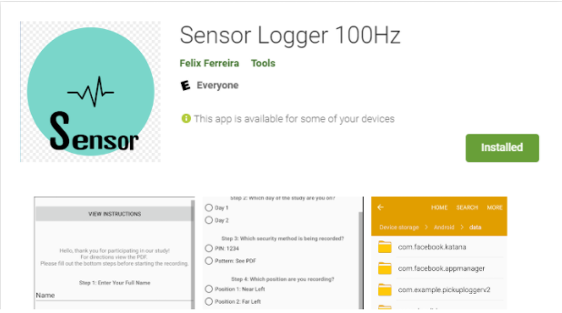
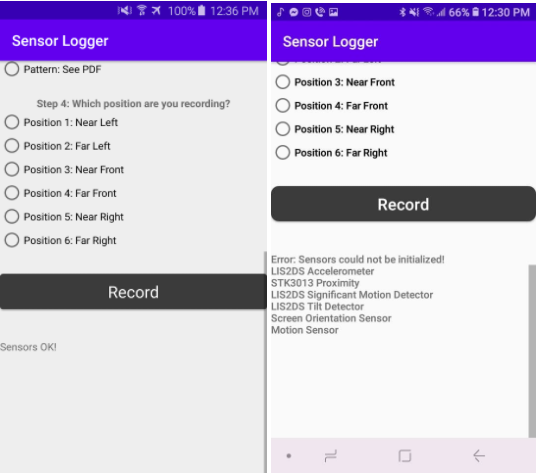
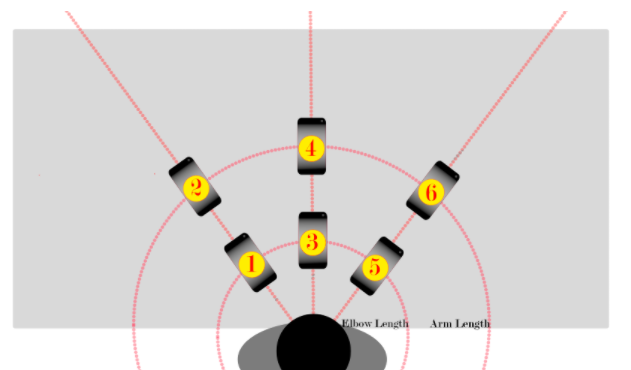
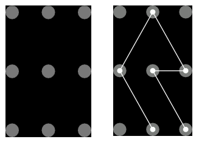

VIDEO GUIDE: https://www.youtube.com/watch?v=FXesHw1R4JQ

Implicit Authentication CSUSM Research
Thank you for participating in CSUSM's research on a new implicit authentication technique. This document covers the essential steps that need to be reproduced by the participant. The goal of performing these steps is to gather user data using the provided phone application.

App Setup

The application can be found on the Google Play store and is compatible with Android devices that have the correct onboard sensors. 

The App can be found by searching "Sensor Logger 100Hz" (with the quote marks) or by using the link below. 
https://play.google.com/store/apps/details?id=sensorLogger.pickUpLogger

The next step is to find out if your device supports the correct on-board sensors.
Open the application and scroll to the bottom. The bottom will have two types of messages.

If your device contains the required sensor devices the message should display: "Sensors OK!". 

Your device should be set up to not light up when you pick it up ie. you should need to click on the power button in order for it to turn the screen on. The feature is called "Lift to Wake" or "Raise to Wake" and should be disabled for the duration of this study. The security being tested is PIN, fingerprint, or pattern, so you should also change you PIN to: 1234

Procedure
The procedure follows many steps. If a mistake is made while following the procedure, shake the phone vigorously(I'll notice it when looking through the graphs),  note it down, and repeat the step. We expect the samples to be of high quality so repeating the sample is better than having a messy sample. Make sure to send your notes with your recording files.

What you need to do:
Find a chair and a clear desk that will allow you to perform all motions below comfortably. For the position in this study, positions 1, 3, and 5 are elbow length away. Positions 2, 4, and 6 are arms length away. The phone should be in line with you

Fill out the field information on the application. 
At the start, day should be 1, Security method should be pin, Position should be position 1 near left. For positions reference the images.

Change your security type to the one you are testing. You should be starting on PIN with the code 1234(this is the most common PIN at about ~10%). For pattern reference the image below. Start from the bottom right corner.

Now to start a session for PIN Security:
Place the device flat on the table in its position with the screen facing upwards such that you can click on the record button. Orientation of the phone should make it easy for you to be able to read the screen.

Position 1:  
Fill out our application information fields properly  
Place phone in its positions facing towards you  
Click Record  
Lock phone by powering off the screen  
Pick up phone  
Unlock Phone  
Open Play Store ->  
	-> Categories ->  
	-> Education ->   
	-> Scroll to bottom to premium apps ->   
	-> Click on the 5th premium app(DO NOT DOWNLOAD) ->   
	-> Close the Play Store  
Reopen our application  
Stop recording  
Repeat 15 times  
  
  
Repeat for the rest of the positions(2-6)  
  
  
Repeat procedure using Fingerprint or Pattern Security, your choice!  
  
  
Repeat PIN and the secondary security method of your choice for sessions
on day 2.  
  
In total you should end up with this number of files:  
Day 1:  
	PIN:  
		Position 1: 15 files  
		Position 2: 15 files  
		Position 3: 15 files  
		Position 4: 15 files  
		Position 5: 15 files  
		Position 6: 15 files  
	Fingerprint or Pattern:  
		Position 1: 15 files  
		Position 2: 15 files  
		Position 3: 15 files  
		Position 4: 15 files  
		Position 5: 15 files  
		Position 6: 15 files  
Day 2:  
	PIN:  
		Position 1: 15 files  
		Position 2: 15 files  
		Position 3: 15 files  
		Position 4: 15 files  
		Position 5: 15 files  
		Position 6: 15 files  
	Fingerprint or Pattern:  
		Position 1: 15 files  
		Position 2: 15 files  
		Position 3: 15 files  
		Position 4: 15 files  
		Position 5: 15 files  
		Position 6: 15 files  
  
  For a total of 360 files. If you feel like any are missing or you made a mistake, simply redo the specific day, security type, and position as needed. Make sure the app fields match with the position you are redoing.  
  
  
  
App Fields  
This study will generate many sensor logger files, in order to keep track and document the specific movement by the user the application comes with fields you can fill out while following along with the procedure.  
  
Name: Your full name should be entered here. It will let us know that the data generated is yours. This will be anonymized.  
  
Day: This study occurs over 2 days. The procedure is the same for each day. The study does not have to be back to back, ie. two consecutive days, but should be done promptly.  
  
Security Method: There are three security methods being tested alongside the data recording. We require that you change your pattern or PIN to the application specified pin, pattern, or fingerprint for both your security and for consistency. You may change it back after your session for the day is complete.  
  
Position: This is the field that will change the most. Make sure you click on the correct position. Simply select the position of your phone in regards to the image showing the different positions. Near means elbow length away while sitting in a chair with a straight back. Far means full arms length while sitting in a chair with a straight back.   
  
How to send send data:
Log files that the application generates will be saved as csv files under Device Storage -> Android -> data -> sensorLogger.pickUpLogger -> files or similar. Simply selects all files, compress(should appear under the three dor options), select the compressed file and share -> email to 13thfinance@gmail.com . If the file is too big, you can save to Google drive and send us a shared link for us to download.  
  
Thank you for your cooperation!  

